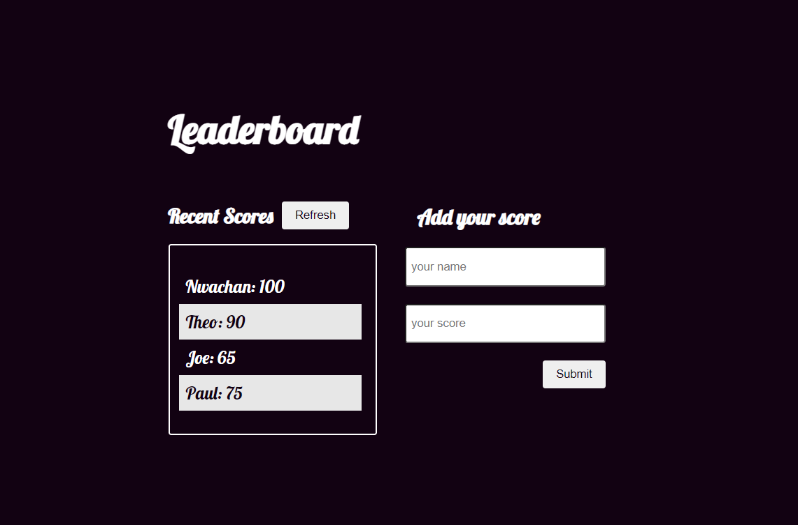

# Leaderboard Website

> The leaderboard website displays scores submitted by different players. It also allows you to submit your score. All data is preserved thanks to the external [Leaderboard API service](https://www.notion.so/microverse/Leaderboard-API-service-24c0c3c116974ac49488d4eb0267ade3).

## Website Link

[Click to see Website](https://theophileaseh.github.io/Leaderboard/)

## Screenshot

## Built With

- Major languages: Javascript, HTML & CSS
- Frameworks: none
- Technologies used: Webpack, Leaderboard API service

## Getting Started

To get a local copy up and running follow these simple example steps.

### Prerequisites

``VS Code or other Code Editor``

``"Live server" configured``

### Install

``git clone https://github.com/Theophileaseh/Leaderboard.git``

``cd Leaderboard``

### Usage

``run "npm i"``  
``run "npm start"``

``run "npm build" to create a development build``

## Authors

👤 **Nwachan Theophile**

- GitHub: [@Theophileash](https://github.com/Theophileaseh)
- Twitter: [@NwachanT](https://twitter.com/NwachanT)
- LinkedIn: [LinkedIn](https://linkedin.com/in/nwachan-theophile)

## 🤝 Contributing

Contributions, issues, and feature requests are welcome!

Feel free to check the [issues page](../../issues/).

## Show your support

Give a ⭐️ if you like this project!

## Acknowledgments

- Hat tip to anyone whose code was used
- Inspiration
- etc

## 📝 License

This project is [MIT](./MIT.md) licensed.
